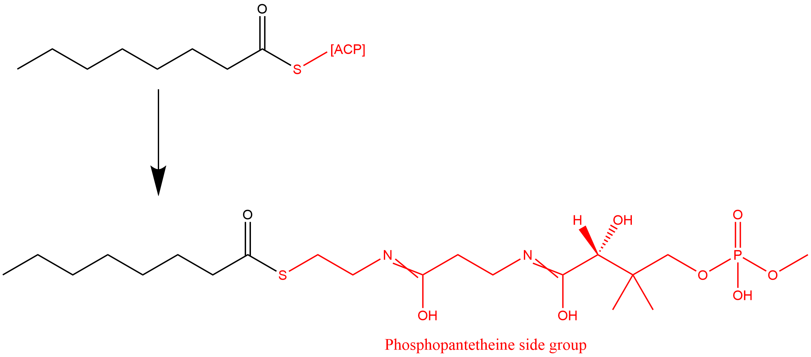

# On the estimation of Thermodynamic constants in iCH360
## Manual computation of free energies of reaction estimates
In the [drg0_estimation.ipynb](./drg0_estimation.ipynb) notebook, we use the component contribution (CC) framework [1] and the EQuilibrator database [2] to estimate the free energies of reaction for the reactions in iCH360. For the majority of reactions in the model, these can be automatically obtained via the EQuilibrator API. However, at the time of writing, the API is unable to compute the estimates for a subset of reactions in the model involving protein prosthetic groups (e.g. the ACP- groups taking part in most reactions in the fatty acid biosynthesis pathway). 

The reason for this is that the component contribution methods works by decomposing compounds in smaller chemical groups and such decompositions are of course not available for complex metabolites such as those containing protein side groups. However, when estimating the  $\Delta_rG^\circ$ of a reaction via the CC method, only the _net_ formation of loss of chemical groups matters. Since, in practice, these "undecomposable" groups are conserved within the reactions in our model, we don't formally need their chemical decomposition to estimate the $\Delta_rG^\circ$ of these reactions. By reproducing the EQuilibrator pipeline _manually_ we can exploit this fact and estimate free energy mean vectors and covariances that include these reactions, thus extending the thermodynamic coverage of the model.

If we were only interested in computing standard free energy of reaction, $\Delta_rG^\circ$, we could simply extend the EQuilibrator group incidence matrix (matrix $G$ in [2]) with "dummy" groups (e.g. a [-ACP] chemical group) and use these to compute the decomposition for the relevant metabolites. However, in order to compute _transformed_  standard free energy of reaction, $\Delta_r'G^\circ$, one does unfortunately require knowledge of the specific chemical composition of each compound.

Toa address this issue, we thus replaced all protein-involving groups by a chemical group that best mimic the chemical environment of the original side-group. Particularly:
- For *ACP-bound compounds*, the ACP side group was replaced by a Phosphopantetheine group, which is the natural prosthetic group of the acyl carrier protein (ACP)
- The *free ACP protein* was approximated by a a Phosphopantetheine (PPT) group, where the attachment site to the ACP scaffold is methylated
- For the protein cofactor *glutaredoxin*, its Cys-Pro-Tyr-Cys active site was used, with the two cysteines being either free (for the reduced form of the protein) or bound by a disulfite bridge (for the oxidised form of the protein). 

For example, let's consider the example of the octanoyl-ACP metabolite (bigg:ocACP). For computing thermodynamic estimates, the original protein bound compound (top) is replaced with the chemically "tractable" version ocPPT (bottom) where the ACP is replaced by a PPT side group.

By systematically performing these replacement across all relevant compounds in the model, we obtain the set of "equivalent" compounds shown below:

These decomposable approximations of the original compounds were added into a custom EQuilibrator local cache file named `custom_compounds_cache.sqlite`, which is then used instead of the default cache in our estimation pipeline. Due to the large size of the file, the file is not included in this repo. If you wish to reproduce the pipeline by running [drg0_estimation.ipynb](./drg0_estimation.ipynb), please use the ZENODO version of the repository, available at XXXX.
## A note on formation energies computation
In the last section of [drg0_estimation.ipynb](./drg0_estimation.ipynb), we compute a set of formation energies ($\Delta_f'G^\circ$) for each compounds in the model. We do this for user-convenience, since some packages (e.g. PTA, see [pta.ipynb](../../Analysis/PTA/pta.ipynb)) use formation energies as a basis to compute reaction energies, that is
$$
\Delta_r'G^\circ=S^T~\Delta_f'G^\circ
$$
where $S$ is the stoichiometric matrix of the network.Plugging in the formation energy vector in the above formula will produce exactly the same the reaction free energy vector that we computed directly before. However, the _absolute_ formation energies are by our side-group replacement procedure (coming back to the example above, the formation energy quoted for the ocACP metabolite is actually the formation energy of the ocPPT compound). Hence, these formation energies are only provided for convenience, but **should not only be used as a basis to compute reaction energies**.

## References
1. Noor, E., Haraldsdóttir, H. S., Milo, R. & Fleming, R. M. T. Consistent Estimation of Gibbs Energy Using Component Contributions. PLOS Computational Biology 9, e1003098 (2013).
2. Beber, M. E. et al. eQuilibrator 3.0: a database solution for thermodynamic constant estimation. Nucleic Acids Research 50, D603–D609 (2022).
